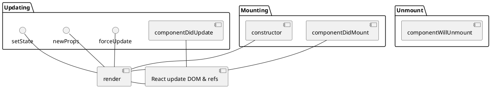

# React JS Task 1

* Студент: [Мрикаев Константин](https://github.com/micasa-acerman).

## Картинка

## Таблицы и Форматирование

| Форматирование | Результат |
| :-- | ---: |
| \* Курсив \* | *Курсив* |
| \*\* Жирный \*\* | ** Жирный ** |
| \*\*\* Курсив+жирный \*\*\* | *** Жирный+Курсив *** |

```json
{
  "course": "Learn React for begginers",
  "progress": "2%",
  "duration": 2
}
```

## UML




[Редактировать ⚡️](https://stackblitz.com/edit/react-rdjb4x)